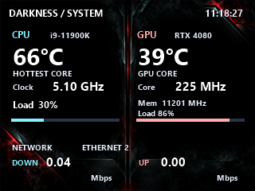

# OpenRGB Chroma Bridge

## G19 LCD dashboard

The [G19 System Dashboard](G19Dashboard/README.md) is a separate companion app for
the keyboard's 320x240 LCD. It shows CPU temperature, clock and load; NVIDIA GPU
temperature, core/memory clocks and load; and network upload/download rates.
Bright statistics are drawn over the included custom Darkness background.

The display refreshes once per second using Core Temp shared memory, NVIDIA NVML,
and Windows network counters. The LCD now uses G19USB with libusbK, without LGS.
See the dashboard guide for driver setup, rollback, tests, and hardware validation.



## Logitech G19 lighting

The dashboard owns the G19 libusbK USB handle for both LCD frames and RGB control.
The bridge sends its latest animation color over a same-user local named pipe;
the dashboard applies feature report 07 without color correction and returns
hardware RGB readback. Every reply is checked against the requested color.
This preserves Off, Static, Breathing, and Spectrum colors from the shared clock.

`EnableLogitechLighting` controls this output. Run both the dashboard and bridge
under the same Windows user. Both watchdogs remain required. If the dashboard is
unavailable, G19 lighting retries every five seconds while other lighting continues.
The pipe replaces the previous HID backend and requires the libusbK dashboard.
No additional driver change is needed. G-keys/macros are outside this integration.

Physical validation: LCD writes and RGB hardware readback succeeded together on
a G19. The bridge logs shared USB frame counts and readback matches every 30 seconds.

## ManO'War direct integration

The bridge now performs a read-only startup probe of the ManO'War receiver's
vendor HID collection (`1532:0A02`, interface 3). On the validated receiver it
reports 64-byte input, output, and feature reports, matching the available
lighting and button captures. This leaves the USB audio interface and its
standard Windows driver untouched.

Direct ManO'War lighting and button support is in development. Until it has
passed physical tests, the bridge continues using the existing Razer Chroma SDK
path; Synapse 2 and the Chroma SDK must remain installed and running.

A Windows background bridge that keeps OpenRGB devices and a legacy Razer
ManO'War synchronized through the Razer Chroma SDK.

This background utility uses a one-LED OpenRGB virtual controller named
`Chroma Bridge` as its control surface and mirrors that color to the physical
OpenRGB devices and the Razer ManO'War through the local Razer Chroma SDK.

Supported mappings:

- OpenRGB Off -> headset Off
- OpenRGB Static/Direct -> headset Static
- OpenRGB Breathing -> headset Breathing
- OpenRGB Spectrum Cycle -> headset Spectrum Cycling

The Razer Ouroboros has fixed-color lighting, so it is not a Chroma color target.

The bridge applies one synchronized breathing clock to the EVGA motherboard, all
detected `TT LEDFanBox` controllers, the Razer Firefly, the NVIDIA GPU lighting, and
the Razer ManO'War. The virtual `Chroma Bridge` controller is included in the same
clock. OpenRGB devices use Direct or Static mode so every device follows the same
phase.

The virtual controller exposes Direct, Static, two-color Breathing, Spectrum Cycle,
Wave, and Off. Its speed, brightness, colors, and Wave direction are rendered by
the bridge on one monotonic clock. Physical devices stay in their frame-driven
Direct or Static transport modes, which prevents their independent hardware clocks
from drifting apart.

The included active profile is `White to Red - Speed 30`. It slides from full white
to full red and back at constant brightness. On OpenRGB's 0–100 speed scale, speed
30 produces an 11-second cycle.
The white and pure-red endpoints each hold for 10% of the cycle so slower devices,
including the ManO'War, visibly reach the exact endpoint color.
The legacy ManO'War path is paced at 300 ms, led by 700 ms to compensate for
Synapse 2 latency, and reaches pure red early enough to hold it through the shared
red endpoint.
Set `FollowSourceColor` to `true` to replace the profile's first color with the
color selected on the virtual `Chroma Bridge` controller.

The Razer Ouroboros cannot participate because its lighting color and animation are
fixed by the mouse hardware.

## Requirements

- Windows 10 or 11
- OpenRGB 1.0 with the SDK server available on `127.0.0.1:6742`
- .NET 9 Desktop Runtime, or a self-contained publish
- Razer Synapse 2 with Chroma Apps enabled
- Razer Chroma SDK Core and `CChromaEditorLibrary64.dll`

## Build

```powershell
dotnet restore
dotnet publish -c Release -r win-x64 --self-contained false
```

Copy `CChromaEditorLibrary64.dll` beside the published executable if it is not
installed in the Windows system path. Edit `bridge-config.json` to match the
OpenRGB source device and desired synchronized profile.

Run `install-virtual-controller.ps1` once to add the one-LED `Chroma Bridge`
virtual controller to the OpenRGB service configuration. The script requests
administrator access, backs up `OpenRGB.json`, and restarts the OpenRGB service.
The shared mode list requires the companion custom OpenRGB build or the included
`patches/OpenRGB-Chroma-Bridge-modes.patch` applied to OpenRGB 1.0.

This repository also carries a small OpenRGB.NET socket-shutdown patch. It lets the
bridge poll the virtual master without delaying animation frames when a watcher
connection closes.

The custom motherboard integration and verified HID report format are covered
in [EVGA Z590 DARK USB lighting](docs/EVGA-Z590-DARK-USB.md).

## Operation

The bridge starts automatically when the current Windows user signs in. It runs in
the background and writes status information to:

`%LOCALAPPDATA%\OpenRGB Chroma Bridge\bridge.log`

The source device, two colors, speed, frame interval, and minimum brightness can be
changed in `bridge-config.json`. Saved profile configurations are kept in the
`Profiles` folder. Close the bridge before editing that file, then start it again to
load the change.

If OpenRGB or Synapse is temporarily unavailable, the bridge waits and reconnects.
It reads the virtual `Chroma Bridge` controller as the master and applies its mode,
colors, speed, brightness, and direction to every synchronized device. Selecting
Direct on the master restores the configured `White to Red - Speed 30` profile and
restarts its cycle from full white. Changes made on individual physical devices can
be overwritten on the next shared-clock frame.

For startup reliability, register `watchdog.ps1` in the current user's Windows Run
key. It launches the bridge in the interactive desktop session required by legacy
Synapse 2 and restarts it if the process exits or animation logging becomes stale.

The synchronizer is not a Windows service. Its startup entry is named
`OpenRGB Chroma Bridge`. The related Windows services are `OpenRGB`,
`Razer Chroma SDK Service`, and `Razer Chroma SDK Server`.
